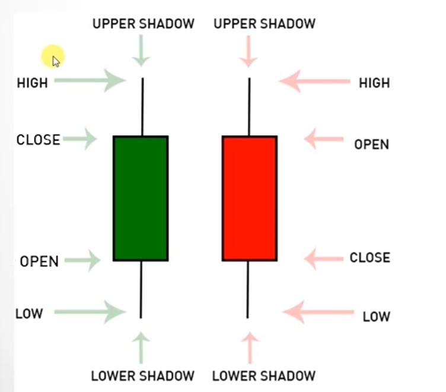
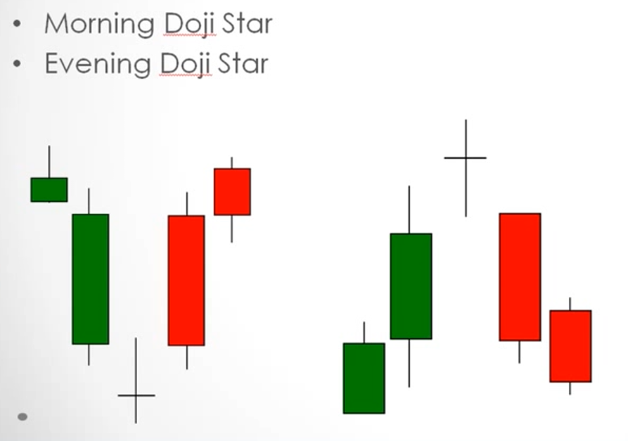

# Learn To Trade The Stock Market. #1 Trading course.

Description - Technical Analysis, Candlesticks, Stocks, Day Trading
- Reference: https://udemy.com/course/foundation-course
- Instructor: Mohsen Hassan

## Section 1: The Basics and The Markets
- Stock Exchange: New York Exchange (Highest criteria to be listed), Nasdaq (Tech stock), AMEX (ETF)
- Broker: somebody you have to gone through to buy or sell your stocks

## Section 2: Orders and Prices
- Ticker for the company stock name: Microsoft (MSFT)
- Two simple order: 
  - Market order (buy directly with the current market price)
    - Just give ticker, buy/sell and quantity
  - Limit order (Only execute the order if the value of the stock falls below the set price)
    - Give ticker, buy/sell, prices and quantity
- Orders make price moves, not the news or events
- Two columns at the system (left: all buyers, right: all sellers)
  - The higher the price you are willing to buy at, your order will be at higher priority
  - The lower the price you are willing to sell, the higher priority your order has
  - If two person are selling at the same price, the person who sell first will be at higher priority
  - Example of the table

| Buyers    | Sellers   |
| --------- | --------- |
| 55 (9000) | 51 (3000) |
| 52 (5000) | 56 (2000) |
| 49 (8000) | 60 (9000) |

- Level 1 quote is the highest price people willing to buy and lowest price people willing to sell
- L1: BUY 55 (9000) & SELL 51 (3000)
- Time of Sales (TOS) logs the list of prices transacted. When someone sell the stock at market price, it means they are willing to sell stock what what the buyers demands at. For example, Seller A is selling 5000 shares at market price. The Buyer A is buying 2000 shares at $50. Buyer B is buying 1000 stock at $48. The remaining 2000 stocks will be sold to the next buyer at the price he is bidding. Let's say Buyer C, he is willing to buy 5000 stocks at $47. The remaining 1000 stocks from Seller A allows Buyer C to get 1000 stocks at $47 but Buyer C is still willing to buy 4000 stocks at $47. So the L1 price is updated to $47 for the buy column
- When a company has good news, it doesn't mean the stock price will be up because sometimes it's about the demand price that cause it to drop
- Bid: the best price you can buy at
- Ask: the best price you can sell at
- Spread: difference between bid and the ask
  - Spread is important to take note of because the larger the spread, if you bought the stock at market price and change your mind directly and sell your bought stocks, the loss will be your spread
- Mutual funds not worth to put money in because every year they take fee and they always choose undervalued stock
- Need to know what mutual funds are holding so you can know when to get out or get in when they trying to sell their shares to get profit
- Hedge funds only very very rich people can play
- Three ways to earn money in Trading:
  - #1 to earn money: long the stock
  - #2 going shorts (bet the price will go down) - ask broker to lend some stock. broker will find stock from clients and lend you, you sell the borrowed stock at £10. you have £10 now. Then the price falls to £8, you buy back the stock at £8, you have £2 in hand. you return the stock to the broker and the broker return the stock to the clients. The clients didn't know their stocks are moved. Cons: Limited earning. if the price fall to £0, you only able to gain a £10 but your loss can be infinite since the stock can rise to like £1000000000 As for long, your loss can be limited but your earn can be infinite. Only short when you know they will fall and never hold shorts 
  - #3 going flat, not trading, your stock is safe

## Section 3: Recommended websites
- Broker: https://www.interactivebrokers.com
- Patterns finder: https://finviz.com/
- Technical analysis website: https://www.tradingview.com/
- Spreadsheet for reference: https://docs.google.com/spreadsheets/d/1fJyqPkmF43ugiLT-v2jc9yxnruyycMbZnIFa6apAijs/edit#gid=1522727147

## Section 4: Technical Analysis
- Two types of analysis
  - 1. Technical analysis: price and volume 
  - 2. Fundamental analysis: Just the basic understanding on the number of employees, revenue per year, debts
- Both techniques are to be used in different situation, example of buying a house 
  - #1 fundamental analysis: check if the pipe are good, the wall, the ceiling since you are not going to sell your house the next day after you bought it
  - #2 technical analysis: check if there is any house being selling nearby, how much is the price etc
- There are alot of charts but we mainly use candlesticks
- #1 Candlesticks: tell more information
  - 
  - Open: The price traded where the ticker starts for the period
  - Close: The price traded where the ticker ends for the period
  - High: The highest price traded within the period
  - Low: The lowest price traded within the period
- #2 Dojis: open and close at the same price in the middle of the high and low. it shows indecisive of the buyer and seller
  - 
- #3 Doji star
  - Doji morning star: Down down down then a Doji at the bottom, it indicates a trend reversal. The next day the ticker will go back up again
  - Doji evening star: Up up up then meet a Doji and fall down
  - 
- The more technique you use in trading, the less predictable it is